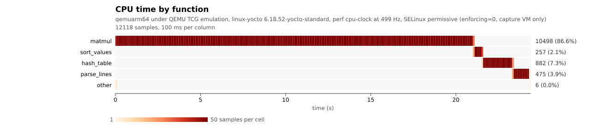
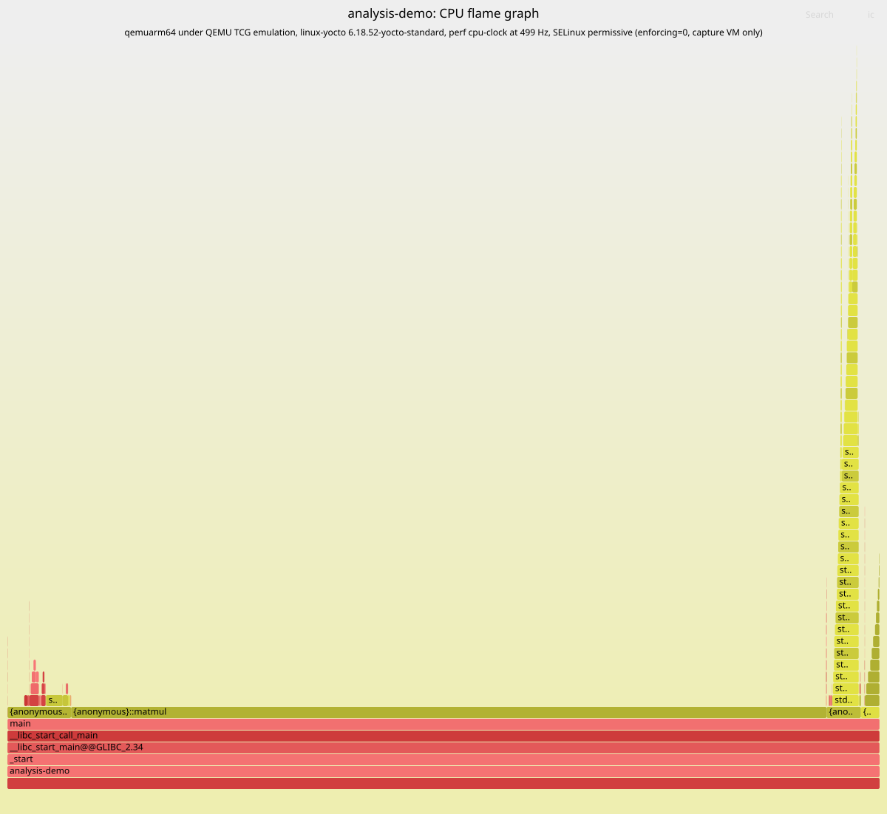

# yocto-jetson-tegra-hardened

A Yocto layer that builds a hardened Linux image for the NVIDIA Jetson
AGX Orin, carrying a complete set of kernel and user-space analysis
tools: tracers, profilers, and what is needed to read a C or C++
program's hot paths as a flame graph or a heat map.

The project started as `yocto-hardened`, a study layer for progressive
hardening on QEMU. It was renamed when the Jetson target became the main
line of work. The older branches (`ext4-dm-verity-selinux`,
`squashfs-selinux-permissive`, `yocto-hpc`) keep their history but are
not maintained against this release.

A `beamfs` branch will be added when beamfs-devel is released publicly.
It will carry the Yocto integration of beamfs - resilient filesystem,
which stays out of `main` until then.

## What it builds

- Yocto Project 6.0 "Wrynose", the current long-term support release.
- meta-tegra, branch `wrynose`: Jetson Linux R39.2.1 (JetPack 7.2.1),
  CUDA 13.2.
- linux-yocto 6.18, an upstream LTS kernel, instead of NVIDIA's 6.8
  vendor kernel. meta-tegra supports it on Orin (tegra234), and the
  NVIDIA out-of-tree drivers carry the patches it needs.
- Machine `jetson-agx-orin-devkit`.

Jetson AGX Thor is not a target: meta-tegra runs it only on the NVIDIA
kernel, which is not an upstream LTS.

## Hardening

The `poky-hardened` distribution builds on Poky and changes the
following:

- no `debug-tweaks`, and a hashed root password is required;
- SELinux, with the `refpolicy-targeted` policy;
- dm-verity in the kernel;
- CVE analysis on every image.

CVE analysis uses `sbom-cve-check`, which replaced `cve-check` in
Wrynose. It reads the image's SPDX 3.0 software bill of materials and
checks it against the CVE List and the NVD. Both databases are fetched
at their latest revision on every build, so a rebuild is also a CVE
update. For the kernel, CVEs in code that is not compiled into this
configuration are excluded. Each image gets three reports next to it in
the deploy directory: an SPDX 3.0 document with the findings, a JSON
manifest in the old `cve-check` format, and a plain-text summary
(`.cve.txt`).

## Analysis tools

`jetson-analysis-image` installs `packagegroup-jetson-analysis`, which
has three parts.

Kernel: perf, trace-cmd, bpftrace, bcc, bpftool, libbpf, SystemTap,
LTTng (tools and kernel modules), blktrace, crash, kexec-tools,
makedumpfile, pahole.

User space, C and C++: gdb and gdbserver, Valgrind, ltrace, strace,
uftrace, heaptrack, LTTng-UST, gperftools, elfutils.

System observation: sysstat, htop, atop, iotop, lsof, stress-ng, fio,
rt-tests.

perf is built with DWARF unwinding and LLVM symbol handling, so call
stacks through C++ code resolve and demangle.

The image's debug symbols are produced as a separate archive rather
than installed on the target. Copy a recording back to the build host
and point perf at the symbols there:

    perf report -i perf.data --symfs /path/to/rootfs-dbg

### Kernel configuration

The kernel always has BTF (what bpftrace and bcc need to read kernel
structures), ftrace with kprobes and uprobes, pressure stall
information, per-task delay accounting, the block I/O tracer, the ARM
performance counters (PMUv3 and SPE), and the hung task detector.

Lock instrumentation is a choice, made in `local.conf`:

    ANALYSIS_PROFILE = "measure"   # default
    ANALYSIS_PROFILE = "debug"

`measure` leaves locks uninstrumented, so that timings and heat maps
describe the code being studied. `debug` adds lockdep, kmemleak and the
object debugging checks; they find locking and lifetime bugs, and they
cost enough to distort any measurement taken with them.

Two sanitizers can be enabled for an investigation, one at a time:

    ANALYSIS_KASAN = "1"   # out-of-bounds and use-after-free
    ANALYSIS_KCSAN = "1"   # data races

Both slow the machine down severely. Asking for both is rejected when
the recipes are parsed.

## Example: profiling a C++ program

`analysis-demo` is a small C++ program shipped in the image for this
purpose. It runs four phases one after the other, each in its own
function: a naive matrix multiplication, `std::sort` over 200 000
integers, a `std::unordered_map` keyed by strings, and `std::regex`
matching. perf sampled the whole run, about 24 seconds, at 499 Hz:
12 118 samples with their call stacks.

In the heat map, each row is one of the four functions and each column
a 100 ms slice; the colour says how many samples fell in the cell. The
phases show up as successive bands, left to right. In the flame graph,
each phase is a tower, and the C++ standard library frames under sort,
the hash table and the regex engine resolve and demangle.

Where it ran. These pictures come from the `qemuarm64` build of the
same layer, distribution and kernel (linux-yocto 6.18.52 with the
analysis fragments), running under QEMU's TCG emulation of a 4-core
Cortex-A57 machine with 2 GiB of memory. The user space is built with
the same `aarch64` tune as the Jetson image. It is not a Jetson: no
Tegra BSP, no NVIDIA drivers, and perf sampled on the software clock
(`cpu-clock`). Absolute durations say nothing about an Orin. Emulation
also distorts the balance between phases: the matrix phase takes 87 % of
the time here (21 s of 24 s), where on the build host, natively, it
took about twice as long as each of the others. The raw figures are in
`docs/demo/capture-output.txt` and `docs/demo/capture-system.txt`.

The capture VM was booted with SELinux permissive (`enforcing=0`):
under enforcing, the policy denies root's SSH session and perf's access
to `perf_event`. The image itself is unchanged; see Status.

To reproduce, after building the `qemuarm64` image:

    bin/jetson-capture.sh --selinux-permissive OUTDIR

It boots the image under QEMU in its own cgroup, runs `perf record -g`
on `analysis-demo`, copies the recording back with rsync, and renders
both pictures on the host with `bin/jetson-render.sh` (FlameGraph for
the flame graph, `bin/jetson-heatmap.py` for the heat map).

## Building

Layers, all on their `wrynose` branch unless noted:

- openembedded-core
- bitbake, branch `2.18`
- meta-yocto (`meta-poky`)
- meta-openembedded (`meta-oe`, `meta-python`, `meta-networking`)
- meta-selinux
- meta-tegra
- this layer

Settings in `conf/local.conf`:

    MACHINE = "jetson-agx-orin-devkit"
    DISTRO = "poky-hardened"
    PREFERRED_PROVIDER_virtual/kernel = "linux-yocto"
    PREFERRED_VERSION_linux-yocto = "6.18%"

The root password lives in `recipes-core/images/credentials.inc`, which
is not tracked. Start from `credentials.inc.example`.

Builds go through `bin/jetson-build.sh`, which runs bitbake inside a
cgroup with bounded CPU, memory and disk bandwidth. The build machine
also runs long test campaigns in virtual machines, and a Yocto build
left unbounded takes everything it can get. The script sizes the memory
budget from what is free when it starts, leaves a reserve for the
virtual machines, refuses to start below a floor, and sets bitbake's
parallelism to match. Every limit can be overridden from the
environment.

    bin/jetson-build.sh jetson-analysis-image
    bin/jetson-build.sh status       # usage, peak, OOM events, throttling
    bin/jetson-follow.py --build BUILDDIR LOG...
                                     # live view of a detached build,
                                     # task logs included
    bin/jetson-build.sh scan         # recipes left with empty object files
                                     # by an interrupted compile
    bin/jetson-build.sh --dry-run -p # show the limits, change nothing
    bin/jetson-build.sh --after PID LOG jetson-analysis-image
                                     # start once the build running as
                                     # PID has finished and succeeded

The cgroup needs root to create, through `sudo`.

## Status

Both images build: `jetson-analysis-image` for `jetson-agx-orin-devkit`
and for `qemuarm64`. The `qemuarm64` image boots and runs the analysis
tools; the example above comes from it. Nothing has been flashed or run
on a Jetson yet.

Known issues, seen on the `qemuarm64` image under SELinux enforcing:

- root's SSH session is denied (no transition from `sshd_t` to
  `unconfined_t`);
- perf is denied access to `perf_event`;
- busybox applets running in confined domains (`dmesg`, `ip`,
  `syslogd`, `klogd`) are denied `map` on `/bin/busybox.nosuid`, and
  `dmesg` crashes at boot.

perf is built without CoreSight trace decoding: it needs `opencsd`,
which comes from meta-arm, not yet part of the build.

## License

MIT. See `LICENSE`.

Maintainer: Aurelien DESBRIERES <aurelien@hackers.camp>
